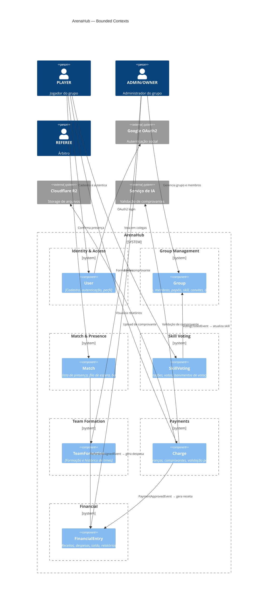

# Diagrama — Bounded Contexts

## Context Map



---

## Relacionamentos entre Contextos

```
┌─────────────────────────────────────────────────────────┐
│              Fluxo de Dados entre Contextos             │
└─────────────────────────────────────────────────────────┘

Identity & Access
      │
      │  userId (referência)
      ▼
Group Management ◄──────────────────────────────────────────┐
      │                                                      │
      │  groupId + memberId (referência)                     │ VotingClosedEvent
      ▼                                                      │ (atualiza skill)
Match & Presence ─────────────────────► Skill Voting ────────┘
      │
      │  matchId (referência)
      ├──────────────────────────────► Team Formation
      │
      │  RefereeAssignedEvent
      ▼
Financial ◄─────────────────────────── Payments
                                          (PaymentApprovedEvent)
```

---

## Linguagem Ubíqua por Contexto

| Contexto | Termos Chave |
|---|---|
| Identity & Access | usuário, credencial, token, sessão, login, OAuth |
| Group Management | grupo, membro, papel, skill, convite, mensalista, árbitro, banimento |
| Match & Presence | partida, presença, confirmação, recusa, lista, vaga, fila, fechamento |
| Skill Voting | votação, voto, estrelas, prazo, banimento de votação |
| Team Formation | formação, time, snake draft, equilíbrio, posição |
| Payments | cobrança, comprovante, diária, mensalidade, validação, revisão |
| Financial | receita, despesa, saldo, relatório, estorno, categoria |
