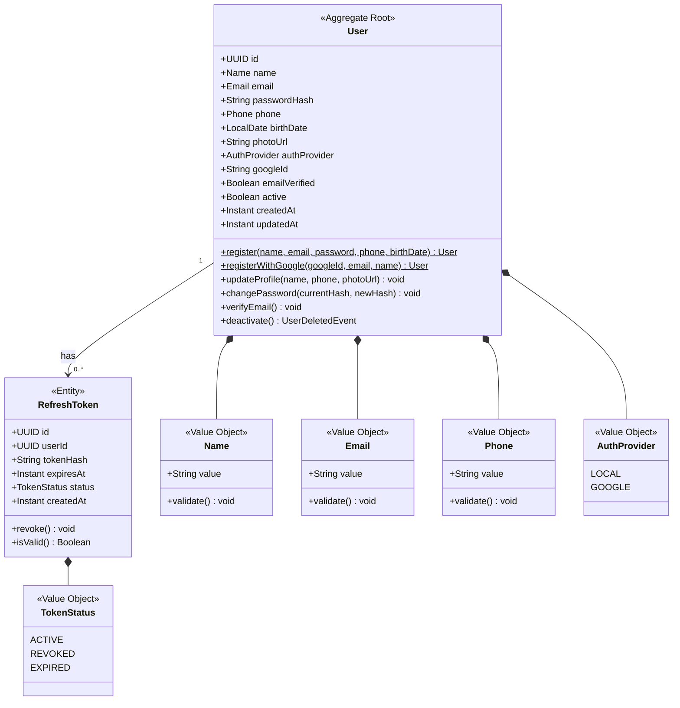
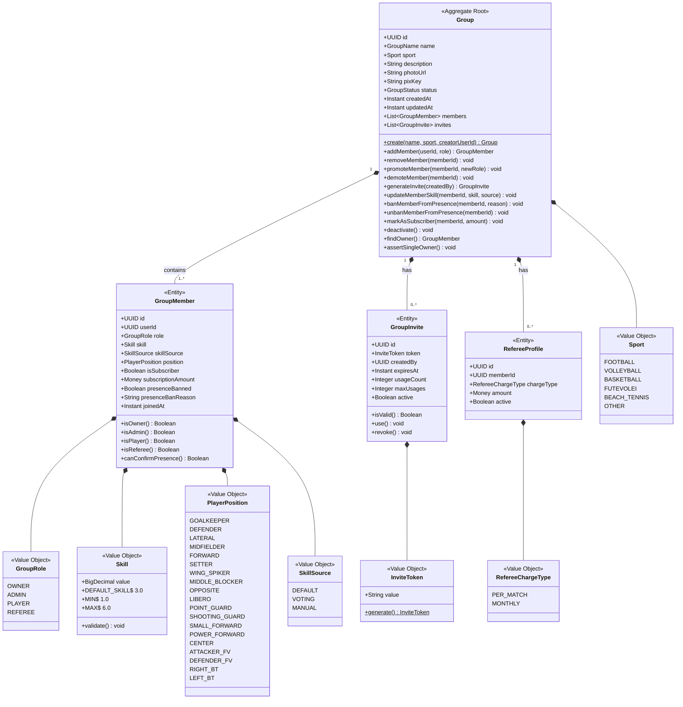
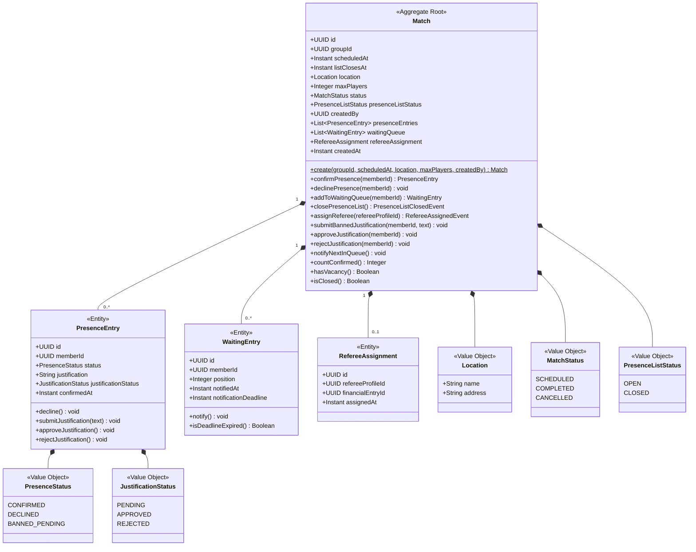
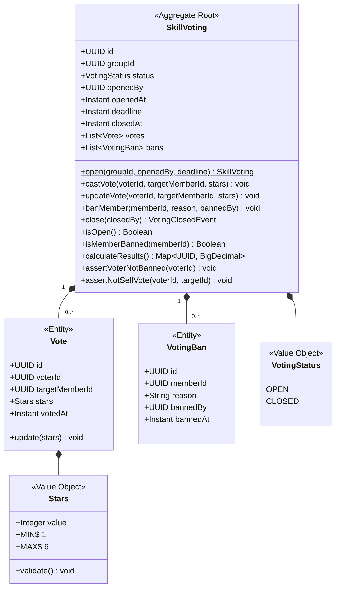
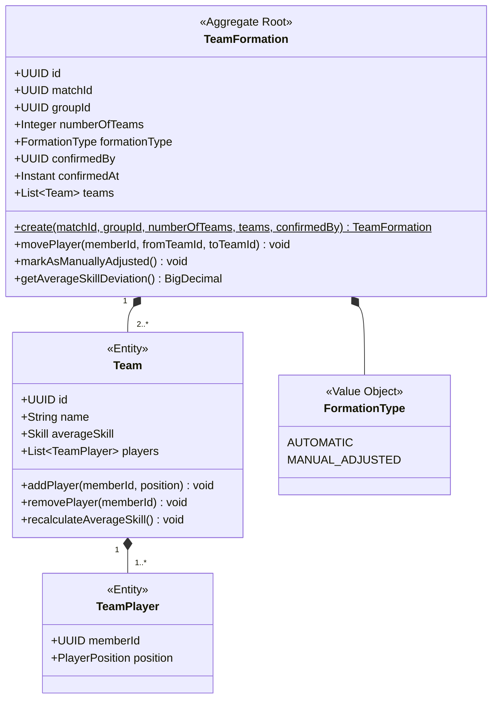
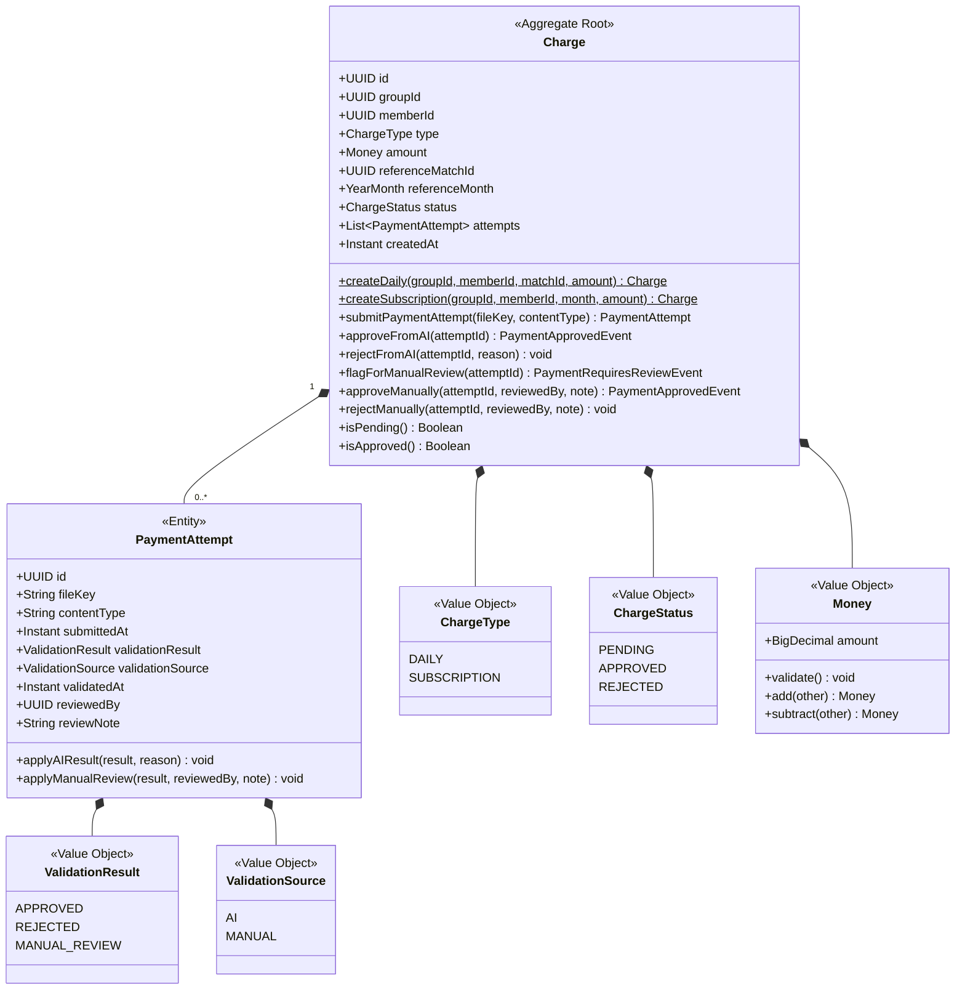
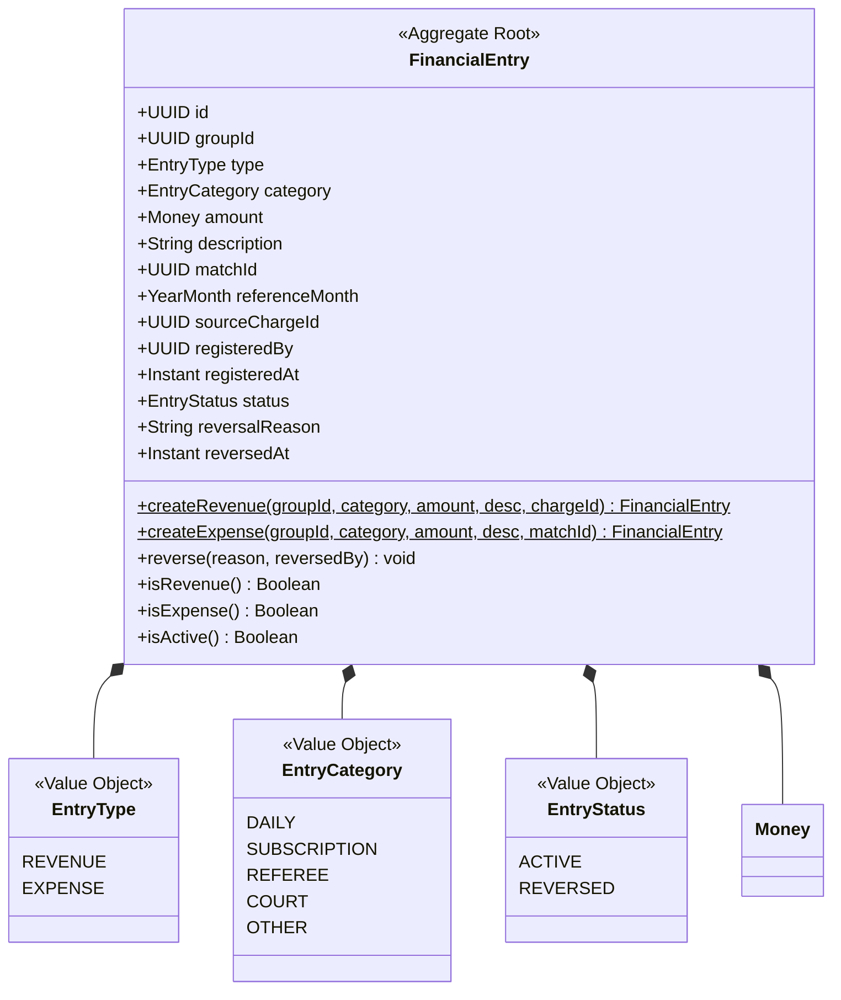

# Diagrama — Modelo de Agregados (UML Classes)

## BC-01: Identity & Access

---

## BC-02: Group Management

---

## BC-03: Match & Presence

---

## BC-04: Skill Voting

---

## BC-05: Team Formation

---

## BC-06: Payments

---

## BC-07: Financial

