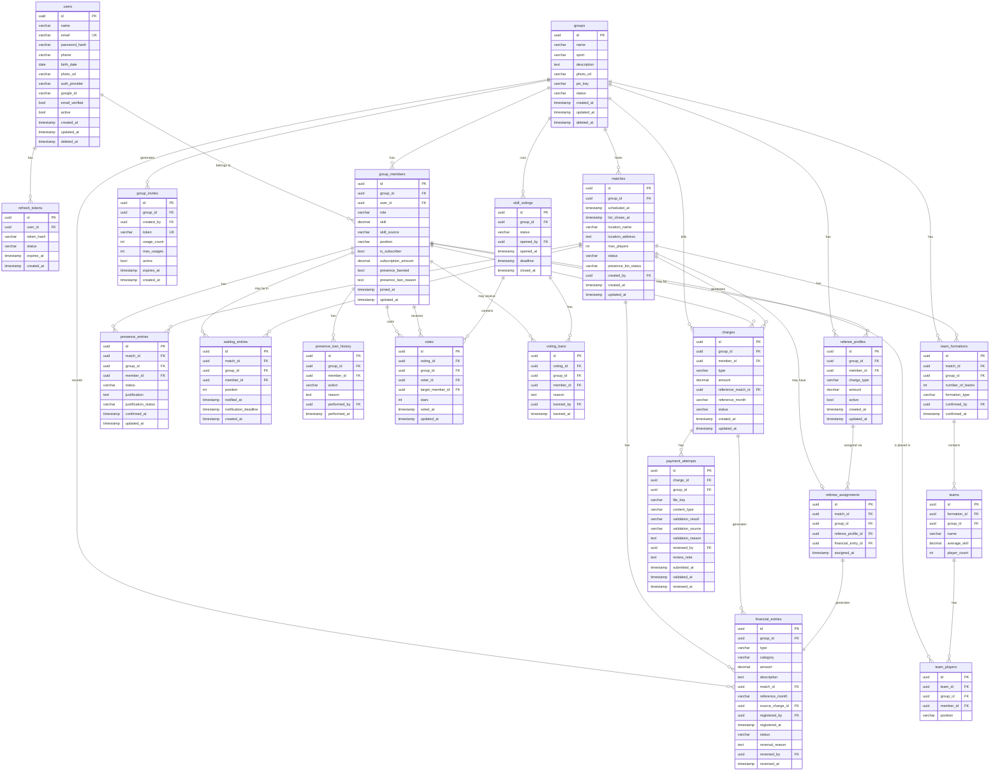

# Diagrama ER — ArenaHub

## Convenções

- Tabelas seguem `snake_case`
- PKs: `id UUID DEFAULT gen_random_uuid()`
- Todas as tabelas de negócio têm `group_id UUID NOT NULL` (multi-tenancy)
- Soft delete: campo `deleted_at TIMESTAMP WITH TIME ZONE`
- Auditoria: `created_at`, `updated_at` em todas as tabelas

---

## Diagrama ER (Mermaid)



---

## Índices Planejados

```sql
-- Acesso por tenant (group_id) — todos os principais endpoints
CREATE INDEX idx_group_members_group_id ON group_members(group_id);
CREATE INDEX idx_group_members_user_id ON group_members(user_id);
CREATE INDEX idx_group_members_group_user ON group_members(group_id, user_id);

CREATE INDEX idx_matches_group_id ON matches(group_id);
CREATE INDEX idx_matches_scheduled_at ON matches(group_id, scheduled_at DESC);

CREATE INDEX idx_presence_entries_match ON presence_entries(match_id, group_id);
CREATE INDEX idx_presence_entries_member ON presence_entries(member_id, group_id);

CREATE INDEX idx_waiting_entries_match ON waiting_entries(match_id, position);

CREATE INDEX idx_skill_votings_group ON skill_votings(group_id, status);

CREATE INDEX idx_votes_voting ON votes(voting_id);
CREATE INDEX idx_votes_target ON votes(voting_id, target_member_id);

CREATE INDEX idx_charges_group_member ON charges(group_id, member_id);
CREATE INDEX idx_charges_status ON charges(group_id, status);
CREATE INDEX idx_charges_match ON charges(reference_match_id) WHERE reference_match_id IS NOT NULL;

CREATE INDEX idx_financial_entries_group ON financial_entries(group_id, registered_at DESC);
CREATE INDEX idx_financial_entries_month ON financial_entries(group_id, reference_month);
CREATE INDEX idx_financial_entries_match ON financial_entries(match_id) WHERE match_id IS NOT NULL;

-- Token lookup (autenticação — hot path)
CREATE INDEX idx_refresh_tokens_hash ON refresh_tokens(token_hash);
CREATE INDEX idx_refresh_tokens_user ON refresh_tokens(user_id, status);

-- Convite por token
CREATE UNIQUE INDEX idx_group_invites_token ON group_invites(token);

-- Email único
CREATE UNIQUE INDEX idx_users_email ON users(email) WHERE deleted_at IS NULL;
```

---

## Constraints de Integridade

```sql
-- Skill entre 1.0 e 6.0
ALTER TABLE group_members ADD CONSTRAINT chk_skill_range
  CHECK (skill >= 1.0 AND skill <= 6.0);

-- Stars entre 1 e 6
ALTER TABLE votes ADD CONSTRAINT chk_stars_range
  CHECK (stars >= 1 AND stars <= 6);

-- Money não negativo
ALTER TABLE charges ADD CONSTRAINT chk_charge_amount_positive
  CHECK (amount > 0);

ALTER TABLE financial_entries ADD CONSTRAINT chk_financial_amount_positive
  CHECK (amount > 0);

ALTER TABLE referee_profiles ADD CONSTRAINT chk_referee_amount_positive
  CHECK (amount > 0);

-- Max players positivo
ALTER TABLE matches ADD CONSTRAINT chk_max_players_positive
  CHECK (max_players > 0);

-- Unicidade de membro por grupo
ALTER TABLE group_members ADD CONSTRAINT uq_group_member
  UNIQUE (group_id, user_id);

-- Unicidade de presença por partida/membro
ALTER TABLE presence_entries ADD CONSTRAINT uq_presence_entry
  UNIQUE (match_id, member_id);

-- Uma votação ativa por grupo (enforced na aplicação; RLS complementar)

-- Votação: voter != target
ALTER TABLE votes ADD CONSTRAINT chk_no_self_vote
  CHECK (voter_id != target_member_id);

-- Um árbitro por partida
ALTER TABLE referee_assignments ADD CONSTRAINT uq_referee_assignment
  UNIQUE (match_id);
```
