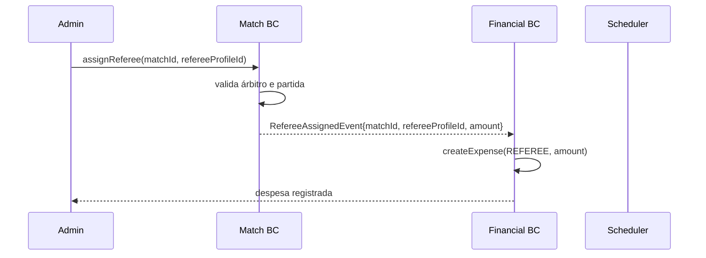
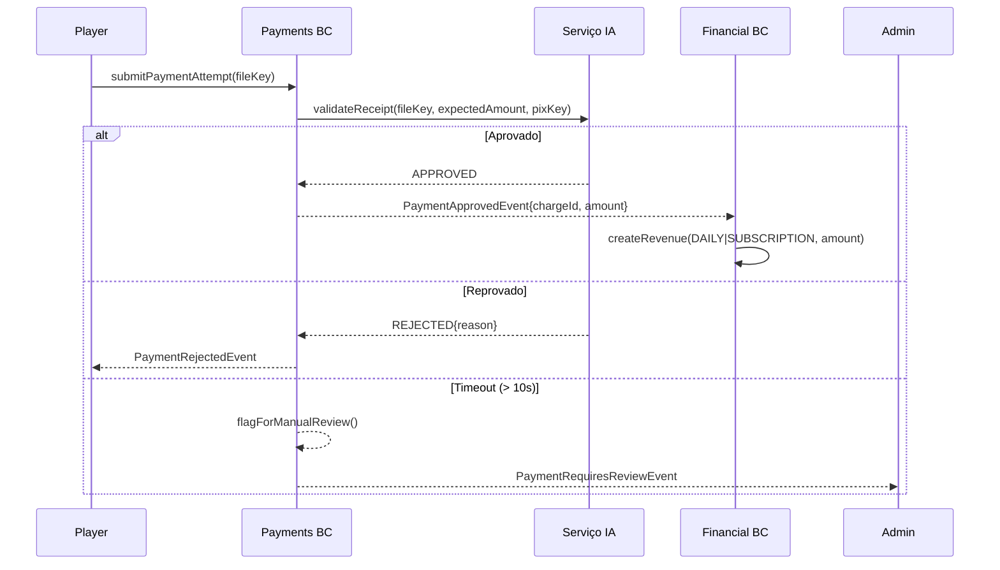
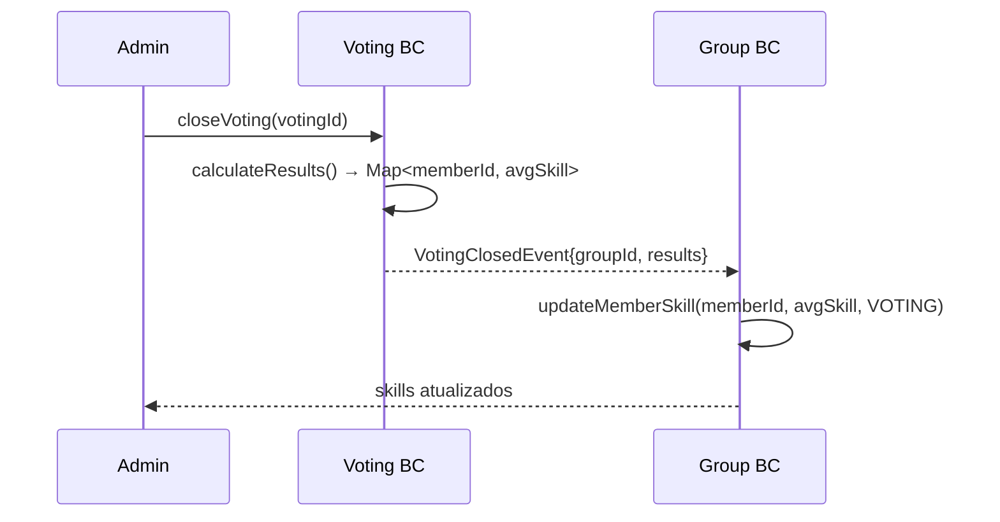
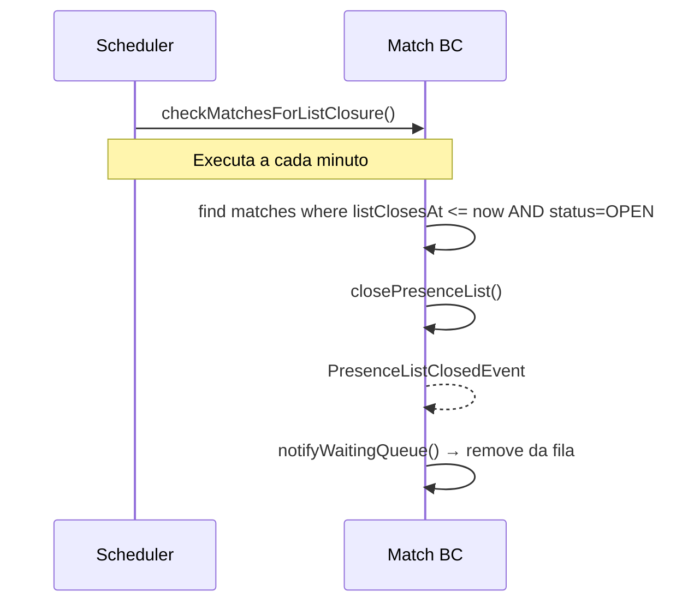

# Diagrama — Domain Events e Fluxos de Dados

## Event Storming — Fluxo Principal

```
┌─────────────────────────────────────────────────────────────────────────┐
│                     Event Storming — ArenaHub                           │
│          (Laranja = Evento | Azul = Comando | Verde = Read Model)       │
└─────────────────────────────────────────────────────────────────────────┘

AUTENTICAÇÃO
────────────
  [Registrar Usuário]
       │
       ▼
  ◉ UserRegisteredEvent
       │
       ├──► Envia email de confirmação
       └──► Cria conta com emailVerified=false

  [Confirmar Email]
       │
       ▼
  ◉ EmailVerifiedEvent
       └──► emailVerified=true


GRUPOS
──────
  [Criar Grupo]
       │
       ▼
  ◉ GroupCreatedEvent
       │
       ├──► Atribui papel OWNER ao criador
       └──► Gera link de convite


  [Aceitar Convite]
       │
       ▼
  ◉ MemberJoinedGroupEvent
       └──► Membro com papel PLAYER


  [Promover Membro]
       │
       ▼
  ◉ MemberRoleChangedEvent


  [Banir de Presença]
       │
       ▼
  ◉ MemberPresenceBannedEvent
       └──► Notifica membro


PRESENÇA
────────
  [Criar Partida]
       │
       ▼
  ◉ MatchCreatedEvent
       │
       └──► Notifica todos os PLAYERs do grupo

  [Confirmar Presença]
       │
       ▼
  ◉ PresenceConfirmedEvent

  [Lista Atinge Limite]
       │
       ▼
  ◉ PresenceListFullEvent

  [T-1h] Scheduler
       │
       ▼
  ◉ PresenceListClosedEvent
       │
       ├──► Notifica jogadores da fila que não entraram
       └──► Habilita formação de times

  [Associar Árbitro à Partida]
       │
       ▼
  ◉ RefereeAssignedEvent
       │
       └──► Financial BC: cria FinancialEntry (EXPENSE, REFEREE)


VOTAÇÃO
───────
  [Abrir Votação]
       │
       ▼
  ◉ VotingOpenedEvent
       └──► Notifica PLAYERs habilitados

  [Encerrar Votação] (manual ou prazo)
       │
       ▼
  ◉ VotingClosedEvent
       │
       └──► Group BC: calcula médias → atualiza skill de cada GroupMember


PAGAMENTOS
──────────
  [Upload de Comprovante]
       │
       ▼
  ◉ PaymentAttemptSubmittedEvent
       │
       └──► IA valida comprovante (assíncrono)

  [IA: Aprovado]
       │
       ▼
  ◉ PaymentApprovedEvent
       │
       └──► Financial BC: cria FinancialEntry (REVENUE, DAILY|SUBSCRIPTION)

  [IA: Reprovado]
       │
       ▼
  ◉ PaymentRejectedEvent
       └──► Notifica PLAYER

  [IA: Timeout ou Incerteza]
       │
       ▼
  ◉ PaymentRequiresReviewEvent
       └──► Notifica ADMIN para revisão manual

  [ADMIN Aprova Manualmente]
       │
       ▼
  ◉ PaymentApprovedEvent (source=MANUAL)
       │
       └──► Financial BC: cria FinancialEntry (REVENUE)


FORMAÇÃO DE TIMES
─────────────────
  [Solicitar Formação]
       │
       ▼
  [TeamFormationService.form()]
  (snake draft por skill + posição)
       │
       ▼
  ◉ TeamFormationCreatedEvent
       │
       └──► PLAYERs visualizam seus times
```

---

## Mapa de Eventos por Contexto









---

## Invariantes Cross-Aggregate Críticos

| Invariante | Como Garantir |
|---|---|
| Somente uma votação ativa por grupo | Verificação no caso de uso antes de criar `SkillVoting`; índice parcial no banco |
| Formação só após lista fechada | Verificação no caso de uso: `match.isClosed()` |
| Árbitro não participa de times | Filtro no `TeamFormationService`: exclui `GroupRole.REFEREE` |
| Mensalista com mensalidade paga não paga diária | `SubscriptionPresenceService` verifica `Charge` aprovada no mês antes de exigir pagamento |
| Receita gerada somente para pagamento aprovado | `PaymentApprovedEvent` publicado somente em `approveFromAI/approveManually` |
| Despesa de árbitro gerada uma vez por partida | Constraint `UNIQUE (match_id)` em `referee_assignments` |
