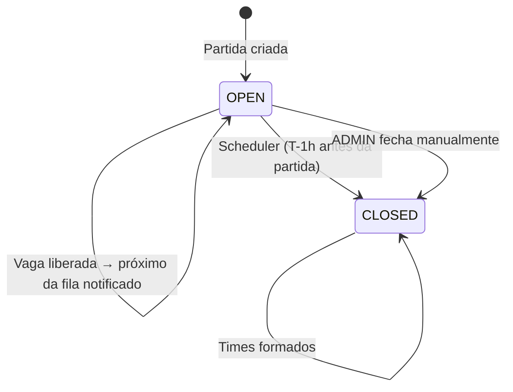
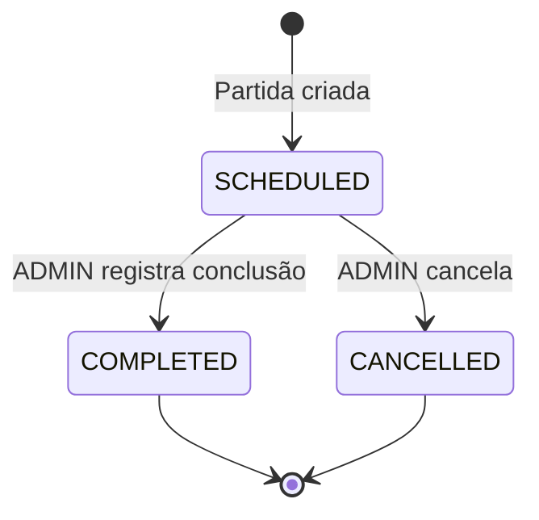
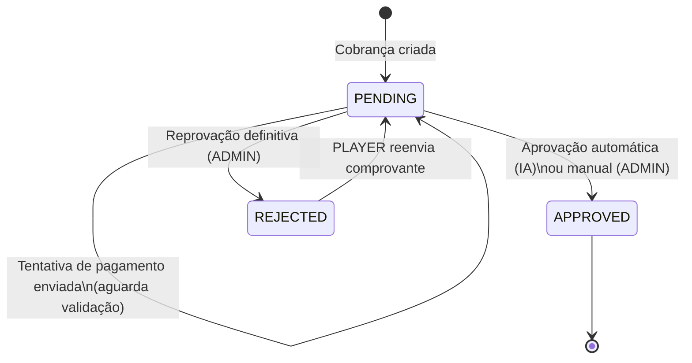
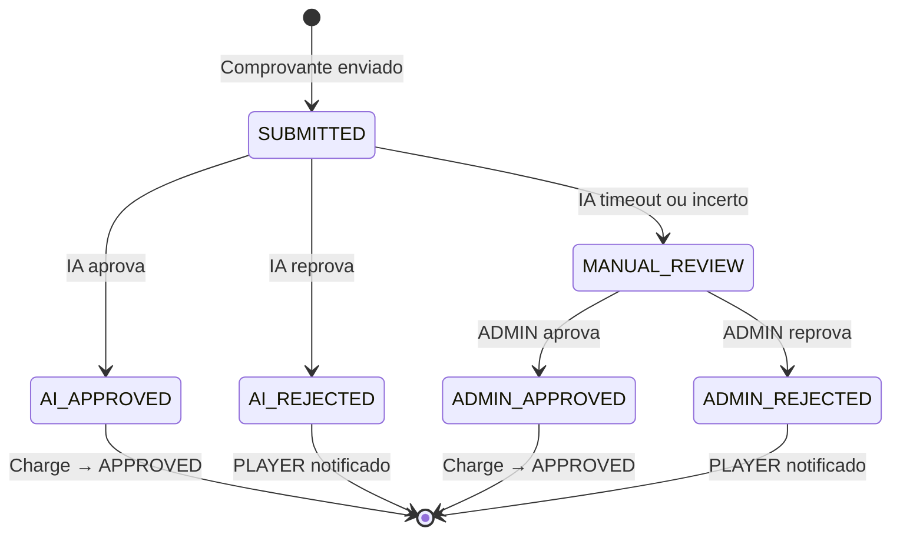
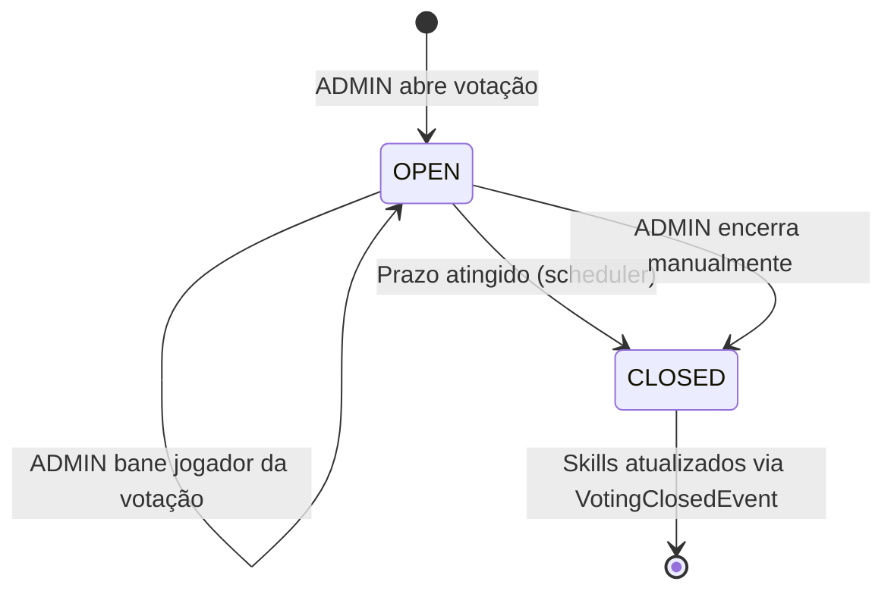
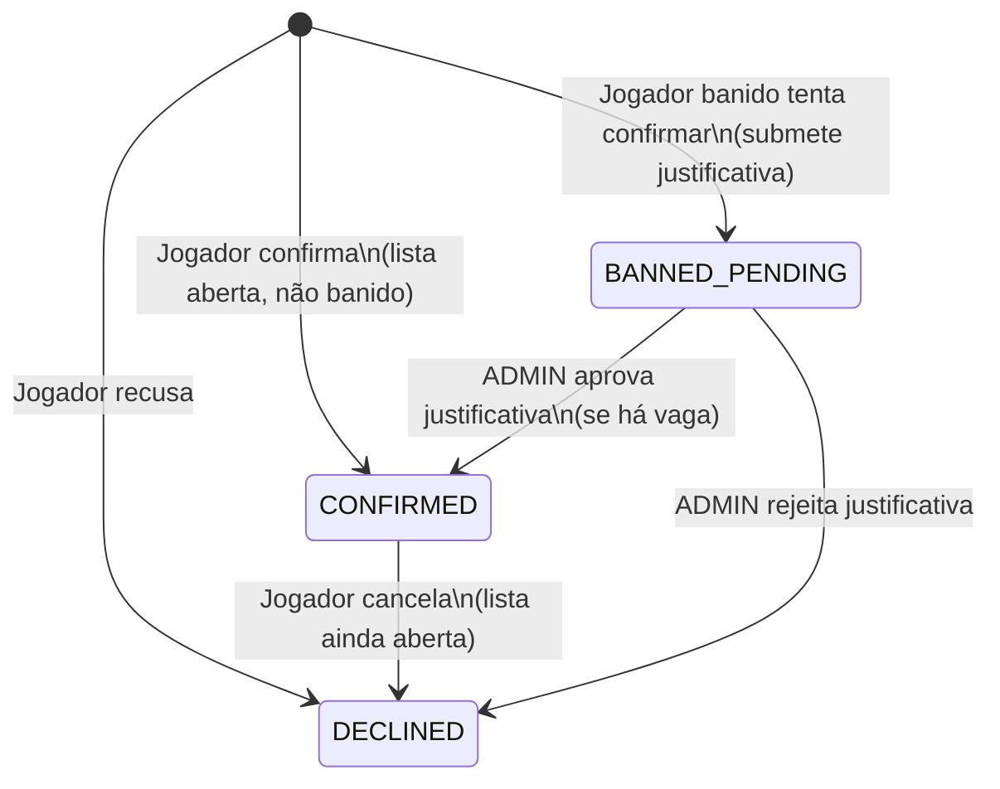
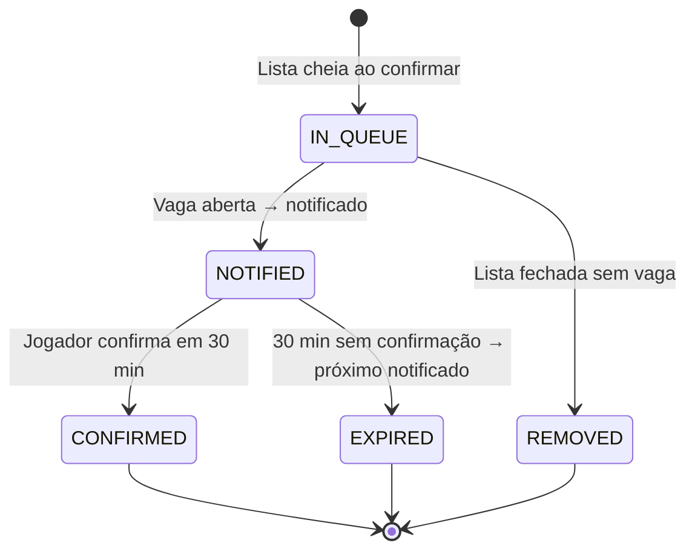
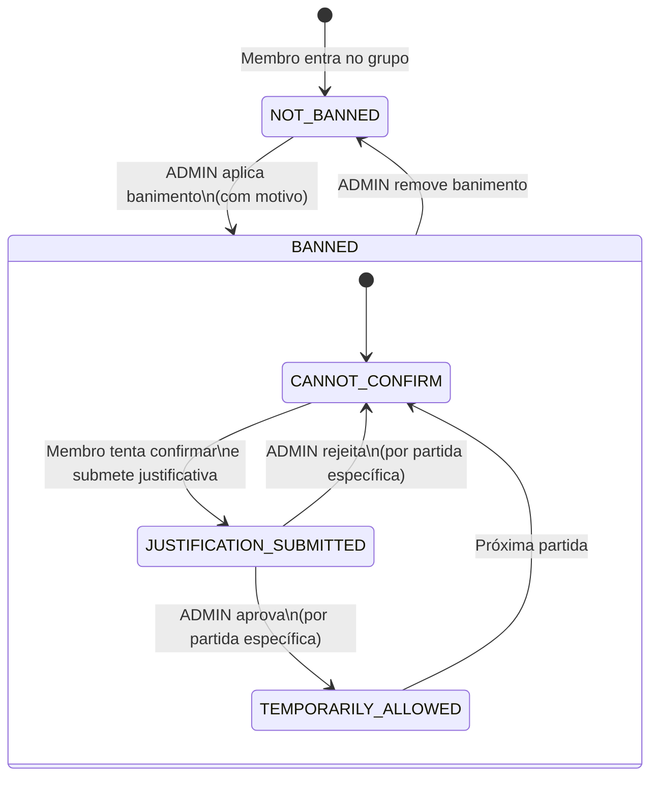
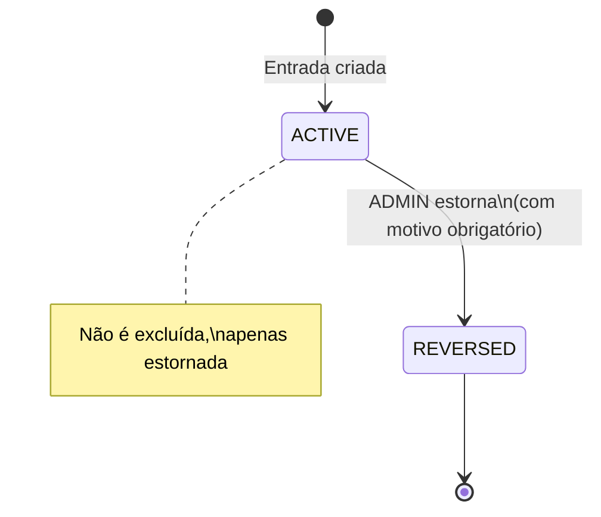

# Diagrama — Máquinas de Estado

## Match.presenceListStatus

## Match.status

## Charge.status

## PaymentAttempt — Validação

## SkillVoting.status

## PresenceEntry.status

## WaitingEntry — Ciclo de Vida

## GroupMember — Banimento de Presença

## FinancialEntry.status

