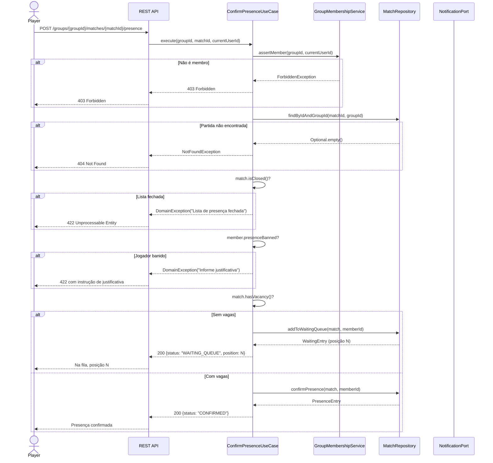
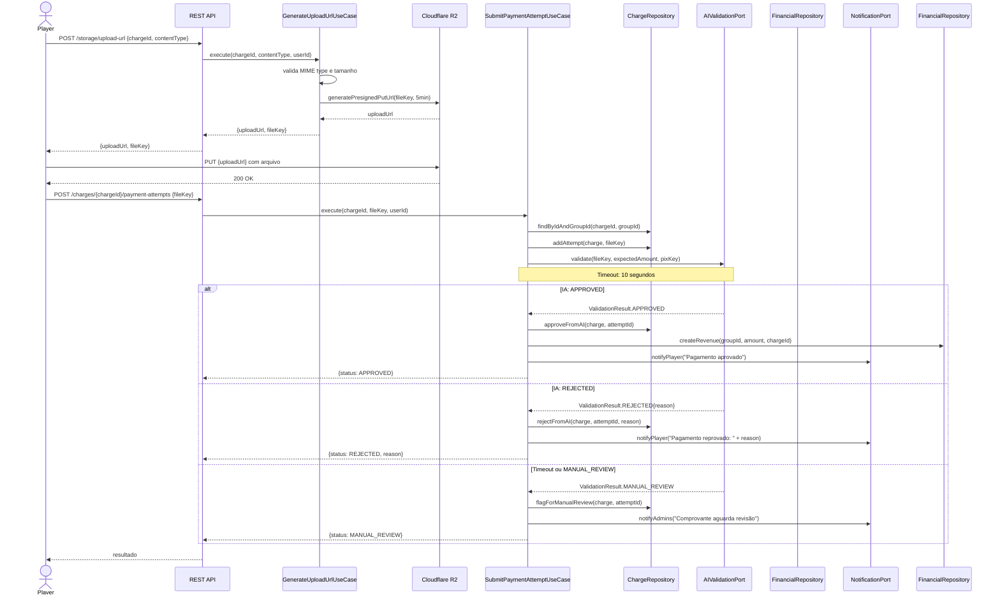
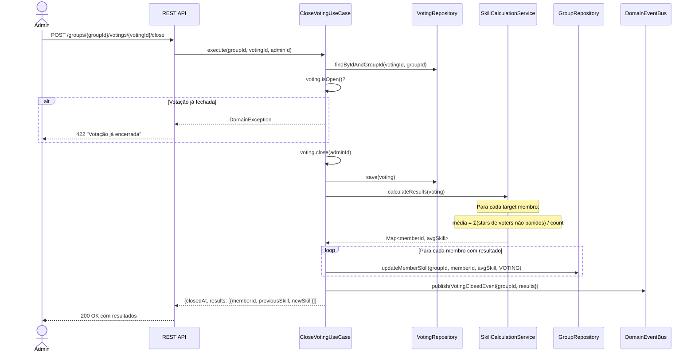
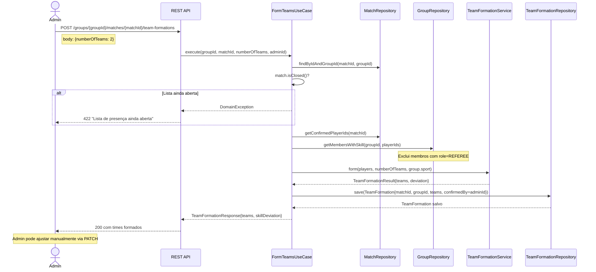
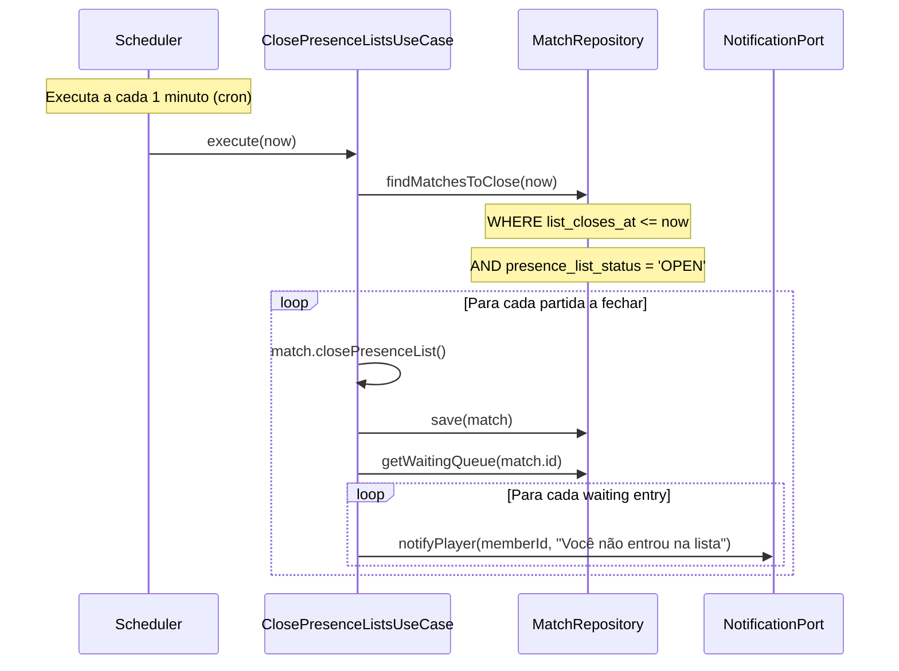

# Diagrama — Sequências de Casos de Uso

## UC-006 — Confirmar Presença (fluxo completo)

---

## UC-012 — Registrar Pagamento com Validação por IA

---

## UC-016 — Encerrar Votação e Atualizar Skills

---

## UC-024 — Formar Times

---

## Scheduler — Fechamento Automático de Lista

